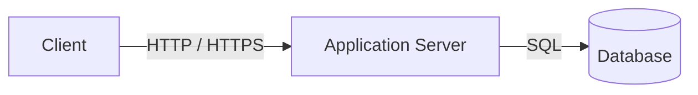
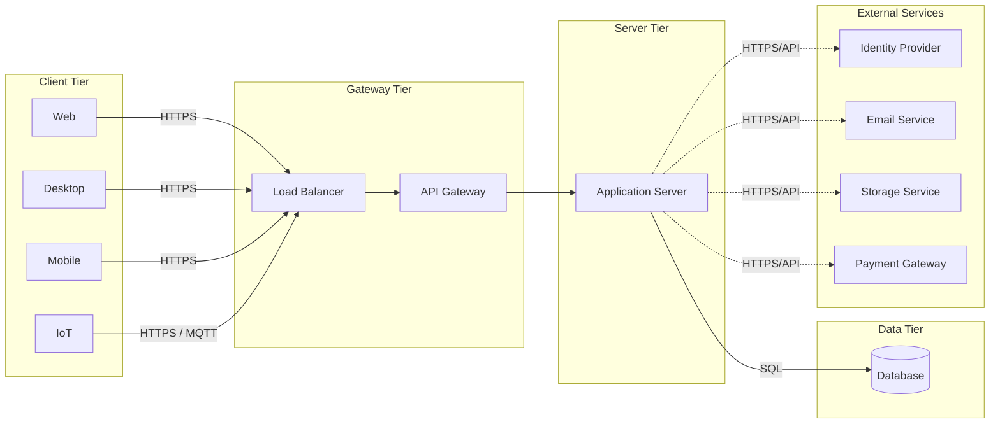

# Architecture

Cakelet is built around a **Client-Server architecture** organized using the **N-tier architectural pattern**.

Rather than prescribing a specific technology stack or deployment model, Cakelet defines a **reference architecture** that serves as the foundation for business applications. Its primary objective is to establish clear architectural boundaries, allowing applications to evolve while keeping the business domain independent from presentation technologies, communication protocols, and deployment strategies.

This document provides a high-level view of the architecture. Each layer and architectural decision is described in greater detail throughout the remaining architecture documentation.

---

## 1. Architectural Overview

Cakelet separates a software system into logical layers with clearly defined responsibilities.

At the highest level, the architecture consists of:

- **Client Tier**, responsible for user interaction or device integration.
- **Gateway Tier**, responsible for traffic routing and access management.
- **Server Tier**, where the application's business domain and communication interfaces reside.
- **Data Tier**, responsible for persistence.
- **External Services**, representing third-party systems consumed by the application.

This organization allows each layer to evolve independently while maintaining a consistent business model across every client application.

---

## 2. Minimum Architecture

Every Cakelet-based application can be reduced to three essential logical components:



Regardless of the project's complexity, these three responsibilities always exist:

- A **Client** that interacts with users or external devices.
- An **Application Server** that centralizes business logic.
- A **Persistence Layer** responsible for storing application data.

Everything else builds upon this foundation.

---

## 3. Logical Architecture

As applications evolve, Cakelet organizes the system into independent logical tiers.



The architecture is divided into logical tiers, each with a clearly defined responsibility.

### Client Tier

Represents every application capable of interacting with the system, including web, desktop, mobile, IoT, or future clients.

The only responsibility of a client is to present information and communicate with the server. Business logic should remain outside this layer.

### Gateway Tier

Acts as the entry point into the system.

Depending on the deployment, it may provide:

- Load balancing
- Request routing
- Authentication and authorization
- Rate limiting
- Traffic management

For smaller deployments, this tier can be simplified or even omitted.

### Server Tier

The **Application Server** is the core of Cakelet.

It centralizes the business domain and exposes multiple communication interfaces depending on application needs.

Typical communication mechanisms include:

- REST APIs
- WebSockets
- Webhooks
- Background Jobs
- Event-based integrations

Regardless of how a request enters the system, every communication path ultimately reaches the same business domain.

### Data Tier

Responsible for data persistence.

This layer abstracts storage concerns from the business domain, allowing database technologies to evolve independently.

### External Services

Business applications frequently depend on third-party systems.

Examples include:

- Identity Providers
- Email Services
- Storage Providers
- Payment Gateways
- ERP systems
- CRM systems
- Other external APIs

These integrations remain encapsulated inside the Application Server and are never exposed directly to clients.

---

## 4. Deployment Perspective

One of Cakelet's design goals is to keep the logical architecture independent from its physical deployment.

The same application can be deployed in different environments without modifying its internal architecture.

### Development

```text
Developer Machine
 ├── Application Server
 └── Database
```

Everything runs locally.

---

### Small Production

```text
Server A
 └── Application Server

Server B
 └── Database
```

The database becomes an independent component while preserving the same logical architecture.

---

### Enterprise Deployment

```text
               Load Balancer
                      │
               API Gateway
                      │
          ┌───────────┴───────────┐
          │                       │
   Application Server     Application Server
          │                       │
          └───────────┬───────────┘
                      │
               Database Cluster
```

Load balancing, high availability, and distributed deployments become infrastructure decisions rather than architectural changes.

---

## 5. Architectural Principles

The architecture is guided by a small set of principles.

### Business Domain First

The business domain is the center of the application.

Everything else exists to support it.

---

### Technology Independence

Business logic should remain independent from presentation technologies, communication protocols, and infrastructure.

---

### Communication is an Implementation Detail

REST, WebSockets, Webhooks, messaging, or any other protocol are simply different ways of reaching the same business domain.

---

### Separation of Responsibilities

Each tier owns a specific responsibility and should remain loosely coupled to the others.

---

### Evolution over Optimization

Architectural decisions should prioritize long-term evolution over premature optimization.

---

### Reference over Framework

Cakelet is intentionally designed as a **reference architecture**, not as a framework.

Its purpose is to document architectural decisions rather than dictate implementation details.

---

## 6. Architecture Documents

This document introduces the architecture from a high-level perspective.

The following documents describe each layer in greater detail.

```text
 Coming son...
```

Reading the documentation in this order allows the architecture to be understood progressively, from the overall system down to the implementation details of each component.